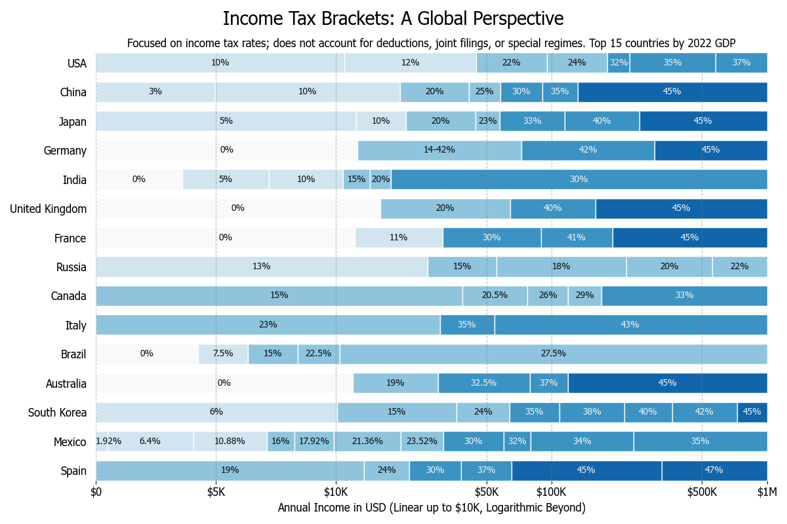

# Income Tax Brackets: A Global Perspective

A visualization of progressive income tax rates in different countries.

## TL;DR


# Installation

Python 3 is required to run this visualization.

```shell
python -m pip install -r requirements.txt
```

# How to run

Just execute:

```shell
python main.py
```

This will open a window with a graph in it and a file named `tax_brackets.png` will be saved it the current directory.